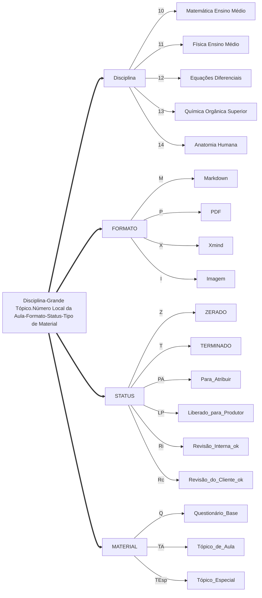
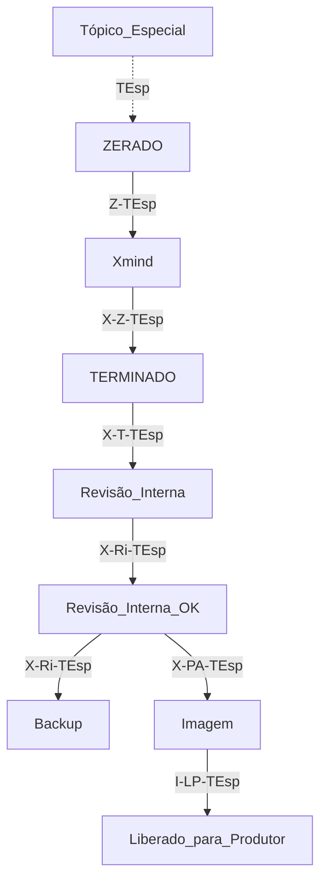
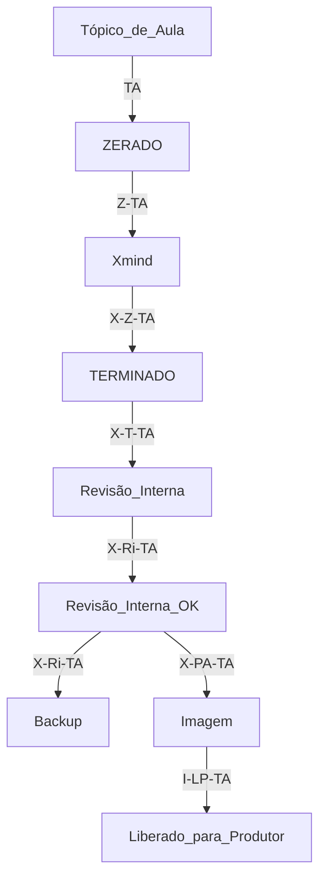
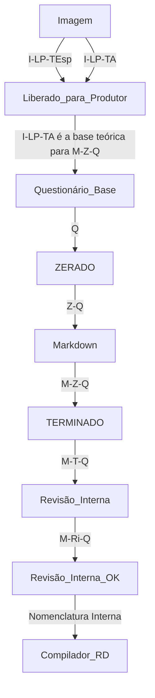
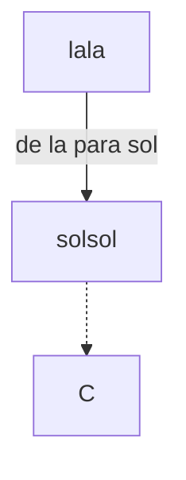
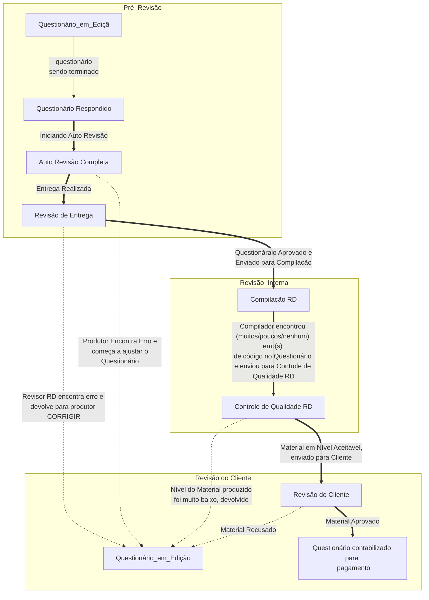

# Materiais de Consulta

## [*Bibliografia Oficial RDResoluções*](https://drive.google.com/open?id=1aOcKJe0X3hSxrmmIlXGZa3BNkWQ72e1o)

## [*Coleção História da Ciência*](https://drive.google.com/open?id=1xgkeJ5f3BzDFNsehQxzxo-8wxYj8Y56n)
## [*Manuais das Plataformas e Programas Trabalhados*](https://drive.google.com/open?id=1Btrs1D67Qc1rVL1_nfB3tNAyJBtfi59e)
## [*Templates Flashcard*][template]
## [*Banco de Imagens da Bibliografia Oficial*](https://drive.google.com/drive/folders/1nAoOAzzn7raTbd0LO4inF2L_a_qEjELQ?usp=sharing)==*Em Construção*==
## Códigos de Aula
* [Códigos D10](https://drive.google.com/file/d/1I3UpPXKEl_KlM0GvIHTm9eHfrNHrcXRv/view?usp=sharing)

* [Códigos D11](https://drive.google.com/file/d/17rx4TWqJ2exf9sHZnCGId33DxPm1z3p8/view?usp=sharing)
* [Códigos D12](https://drive.google.com/file/d/1q0c-8RPIn79UCB3ECg9RsAjiUTK1riO8/view?usp=sharing)
* [Códigos D13](https://drive.google.com/file/d/1MHFFY3uhjEz6wjz45mFMgpRv3SAxHgdM/view?usp=sharing)
* [Códigos D14](https://drive.google.com/file/d/1pcLsmBb6WdRkVy_9vT3C51LDtUfd5srg/view?usp=sharing)


## Disciplinas Disponíveis

<iframe width="650" height="450" src="https://docs.google.com/spreadsheets/d/e/2PACX-1vTMbxgD-YAQG5fvpTzFv7TqJuXhaKaKd0iGTlT-QUiL2sRXIDb7768WZYqE6YIEygqphnKOmg-qGhPN/pubhtml?gid=0&amp;range=A1:D35&amp;single=true&amp;widget=true&amp;headers=false"></iframe>


## O Código dos materiais


Existem combinações de códigos acima que não irão existir, como um tópico de aula escrito na linguagem Markdown. As combinações que um produtor ou ME podem encontrar são:

### Para Tópico Especial

### Para Tópico de Aula

### Para Questionário Base

# Códigos de Resposta
Copie o código desejado abaixo antes de começar a responder o questionário
## *Texto Comum*
```
---
==Resposta(Texto)==
{
conteúdo
}

---
```
## *Um Pouco de História*
```
---
==Resposta(Título)==
{
conteúdo
}

---
==Resposta(Texto)==
{
conteúdo
}

---
==Resposta(Fonte)==
{
conteúdo
}
---
```
## *Referências*
```
---
==Resposta(Referências)==
{
conteúdo
}

---
```
## *Flashcard Interativo*
```
---
==Resposta(Template){cartao_n}{numero_da_template}==
{
==Resposta(Flashcard Interativo)==
{
conteúdo
}
}

---
```
## *Flashcard Interativo com Zoom*
```
---
==Resposta(Flashcard Interativo){cartao_n}{10}==
{
==Resposta(Flashcard Interativo)==
{
|==Elemento==|==Flashcard==|==Fala(Áudio Transcrito)==|==Áudio==|
|:--:|:----:|:----:|:--:|
|**Título**|**Elemento**|**Fala**|**áudio**|
|**Imagem A**|**IMAGEM MÃE**[][][]|**Fala**|**áudio**|
|**ZOOM 1**|[ZOOM 1][][]|**Fala**|**áudio**|
|**ZOOM 2**|[ZOOM 2][][]|**Fala**|**áudio**|
|**ZOOM 3**|[ZOOM 3][][]|**Fala**|**áudio**|
|**ZOOM n**|[ZOOM n][][]|**Fala**|**áudio**|
|**ZOOM n2**|[ZOOM n2][][]|**Fala**|**áudio**|
}
}

---
```
## *Bullet*
```
---
==Resposta(Bullet)==
{
conteúdo
}

---
```
## *Diagramas*
```
---
==Resposta(Diagrama)==
{

```
}

---
```

## *Explicação detalhada sem Exemplo*
```
---
==Resposta(Explicação Detalhada){topico_n}==
{
conteúdo
}

---
```
## *Explicação detalhada com Exemplo*
```
---
==Resposta(Explicação Detalhada){topico_n}==
{
conteúdo

==Resposta(Exemplo)==
{
conteúdo
}
}

---
```
## *Exercício sem alternativa*
```
---
==Resposta(Exercício){Nome_do_Autor_da_Fonte}==
{
conteúdo
}

---
```
## *Resolução sem alternativa*
```
---
==Resposta(Resolução)==
{
conteúdo
}

---
```
## *Exercício com alternativa*
numeração corresponde às alternativas
```
---
==Resposta(Exercício){Nome_do_Autor_da_Fonte}==
{
Enunciado

1.
2.
3.
4.

}

---
```
## *Resolução com alternativa*
```
---
==Resposta(Resolução)==
{

1.
2.
3.
4.
}

---
```
## *Livre*
```
---
==Resposta(Livre){Tipo_de_Resposta}==
{
conteúdo
}

---
```


# O Processo de Revisão
 Ao terminar de ler essa seção, leia com atenção a nota de rodapé.[^20]
## O Fluxo de Trabalho
Após a finalização do Questionário Base se inicia um longo fluxo de revisões. Acompanhe!

## Etapas
### Auto Revisão
Ao finalizar *o questionário*, utilize o *Tópico de Aula* e a *Checklist* para ter certeza que todos os requisitos exigidos foram atendidos. Após isso, realize a entrega para seu coordenador.
### Revisão de Entrega
Nessa etapa revisores da RD irão olhar rapidamente o material para verificar se tudo foi respondido e se o tópico de aula inteiro está presente nas respostas do questionário.
### Compilação RDResoluções e Controle de Qualidade RD
1. Nossa equipe de compilação irá verificar se **a sintaxe do seu questionário está consistente** e testará a **compilação de alguns materiais.** 

2. Caso esteja tudo ok, as versões dos materiais irão para nosso controle de Qualidade, onde será novamente **checado o conteúdo e didática**, em busca de qualquer problema ou evidências de Plágio grave ou **a utilização de material base teórico externo**. 

3. Tendo sinal verde de ambas as equipes, o material compilado é enviado para a revisão do cliente. Até antes do envio ao cliente, **é possível pedir para melhorar o material**. 

4. Após o envio, **somente** a Nota final do Cliente pode ser aumentada, se assim o produtor desejar.
### Revisão do Cliente
A equipe de revisão do Cliente não é revelada para a RD, para evitar qualquer tipo de interferência nossa em favor de um produtor.

Porém, adotamos uma série de medidas que visam proteger nossa equipe, entre elas a exigência de backup de materiais com os comentários de revisores externos. Além disso, listamos diversos avisos para te auxiliar nessa parte do Processo de Revisão Externa. Acompanhe!
#### Dicas Úteis na Revisão Externa

1. **Não Aceite a Correção de um Revisor Externo**

Como não temos acesso direto aos revisores do cliente, _não podemos garantir seu nível acadêmico ou verificar o curso em que tenha se formado._

Ou seja, é possível que um doutorando de física esteja revisando seu conteúdo de mecânica dos materiais e pense que “suas explicações não tem o rigor matemático necessário para o material”.

_“Verifique se de fato o revisor está com a razão. Caso ache que seja uma mudança desnecessária e/ou que o revisor esteja errado em seu pedido de revisão, **conteste-a**”_

2. **Não Use Imagens Fornecidas ou Trechos de Texto Sugeridos por Revisores Externos**

O revisor do Cliente **_NÃO É CAPACITADO_** para lidar com a padronização do material nem garantir sua qualidade gráfica, apenas **garantir que o conteúdo seja pertinente ao que foi proposto no Tópico de Aula** e ao que *ele entenda que seja relevante*. 

* Logo, se o revisor fornecer um trecho de texto a ser substituído, _verifique se faz sentido, se não desordenará o conjunto de texto ao redor e se contém erros de grafia._ 
	* Se você simplesmente aceitar a mudança sem verificá-la, corre o risco de o revisor aprovar seu material e o Controle de Qualidade do Cliente rejeitá-lo, fazendo seu trabalho ser repassado para outro produtor.

* Se o revisor fornecer um diagrama auxiliar para uma explicação, _verifique a qualidade e origem da imagem,_ para evitar erros nos ramos do Checklist do Padrão.

3. **Fale com seu Coordenador antes de Iniciar Qualquer Correção**

Caso esteja com dúvidas sobre o pedido de revisão, _fale com seu coordenador._ _Nunca saia corrigindo tudo o mais rápido possível,_ pois o revisor externo pode estar _errado._ 

Tivemos casos de produtores que refizeram materiais inteiros confiando na correção de um revisor externo.

O caso mais conhecido foi o de um produtor que refez diversas questões de um livro porque o revisor afirmou que _as resoluções não batiam com os enunciados e que provavelmente o livro do produtor (fornecido pela RD) deveria estar desatualizado._

Descobriu-se meses depois que o **revisor externo estava errado.** Pelo menos 100 questões precisaram ser refeitas novamente, o que causou prejuízo considerável para a RD e para o produtor, que não recebeu por tais questões.

# Pagamentos
Nesta seção, vamos abordar o regime de pagamentos de questionários base, porém com excessão  da fórmula de valor para o QB, todo o restante é válido para todos os materiais.
## **Valores Brutos**

* **Resolução Online** R$ 2,35
* **Questionário Base:** R$ 30,00
* **Tópico de Aula:** R$ 4,70

## **Forma de Pagamento**

Atualmente pagamos exclusivamente via transferência bancária, com os custos da transferência pagos pelo produtor (R$1,70 para transferências para o banco do Brasil, R$11,00 para os demais bancos).

Se você não tiver conta própria, pode usar a conta bancária de algum parente ou amigo, mas é preciso que o titular da conta realize alguns procedimentos:

* Escrever uma carta de próprio punho confirmando a autorização do uso da conta para depósitos referentes ao trabalho;

“Eu, _________________________________, portador do RG de nº: ____, CPF de nº__________, autorizo (nome do produtor), portador do RG de nº: ____, CPF de nº__________, a usar a conta bancária de nº________, Agência _______, localizada no (nome do banco), para depósitos referentes ao pagamento por serviços prestados sem vínculo empregatício à RDResoluções, portadora do CNPJ de nº_ _27.201.462/0001-23”

* Forneça Cópia simples do RG e do CPF

Basta que você envie uma fotografia em alta resolução da carta de próprio punho, além das fotos do documento do titular da conta e dos seus próprios documentos pessoais, para financeiro@rdresolucoes.com, com o assunto como *"Produtor/ME/Desenvolvedor RD nº(SeuAIDAQUI), documentos para recebimento em conta de terceiros"*

## **Impostos**

Os valores citados acima não levam em conta abatimentos de imposto, que pode chegar a 15% do valor, além da incidência de impostos adicionais, caso o cliente seja de outros estados do Brasil ou internacional. Consulte seu Coordenador ou nosso [Financeiro](mailto:financeiro@rdresolucoes.com) para confirmar se existe abatimento e o quanto que será abatido. No campo "assunto" escreva "_Produtor/ME/Desenvolvedor RD nº(SeuAIDAQUI), dúvidas sobre tributação_"

## Cota Mínima: Uma História

Um tipo comum de produtor em nosso início como empresa foi o _“pagou, sumiu”._ Bastava pagá-lo integralmente pelo produzido e ele desaparecia em seguida.

Diversas vezes o material produzido retornava para correção após ter sido aprovado pelo cliente (mais comum do que se imagina), o que nos forçava a pagar outro produtor para realizar a correção.

Para evitarmos esse tipo de situação, criamos a “Cota Mínima”.

### Como Funciona a Cota

O Pagamento funciona em Regime de Cota Mínima, ou Saque Mínimo. O menor valor mensal pago pela RDResoluções é de R$ 200,00 (Sem nenhum tipo de desconto ou imposto) para questionário e Tópicos, e R$ 100,00 para Resoluções Online.

### Cota Mínima Mensal

* **(Seis)** 6[^1] questionários produzidos e aprovados pela RD;
* **(Quarenta)** 45[^1] Tópicos de Aula;
* **(Cem)** 50 Resoluções Online;

### Cota atingida
Valor pela cota mínima mais o que for produzido no mês é pago integralmente, *após o material ser aprovado pelo cliente*.
### Cota Não Atingida
Valor do produzido é acumulado para o pagamento do mês seguinte.
## Mês da RD
Começa no primeiro dia útil do mês e termina em seu último dia útil.
## Dia do Pagamento
Se o seu material for aprovado até *uma semana* antes do **último dia útil do mês RD**, o pagamento ocorrerá no *último dia útil do mês seguinte*[^21]
## Fatores que afetam o Valor Pago
Diversos fatores afetam o preço pago por um material, além da própria data de pagamento. Para realizar o cálculo para o **questionário**, utilize a fórmula ao final da seção.
### Alguns cenários[^22]
1. Marcos produziu 4 materiais no mês e saiu da RD, ele não receberá pelos 4 materiais;

2. Marcos produziu 4 materiais e o mês virou, ele não receberá pelos 4 materiais até completar 5 materiais feitos, onde ele receberá por eles quando o cliente aprovar;

3. Marcos produziu 40 materiais e o mês virou, porém apenas 4 materiais foram aprovados pelo cliente,  logo Marcos irá receber no mês seguinte, quando o cliente tiver aprovado pelo menos 5 questionários;
4. Marcos produziu 40 materiais, o mês virou e  20 materiais foram aprovados pelo cliente no meio do mês seguinte,  logo Marcos irá receber por esses 20 no terceiro mês;
5. Marcos produziu 40 materiais, 39 materiais foram aprovados pelo cliente uma semana antes do último dia útil do mês e o mês virou,  logo Marcos irá receber por esses 39 no mês seguinte;
## Critérios de Desligamento da RDResoluções

1. Todo membro da RDResoluções pode se desligar da empresa a qualquer momento;

2. Todo o material ainda a ser pago a ele será retido, do momento do desligamento até que tenham sido totalmente aprovados pelo cliente;
	1. Somente pagamentos que tenham atingido a cota mínima no mês anterior ao do desligamento poderão ser pagos;
	2. O pagamento será feito a um ex-membro se e somente se ele conseguir realizar todas as correções pedidas em seu material durante um prazo de até 6 meses desde sua saída da RDResoluções;
3. Devido ao prazo necessário para as correções, o pagamento do ex-membro será dividido em 6 parcelas mensais;
	1. O pagamento das parcelas restantes será suspenso se o ex-membro se recusar a corrigir algum material produzido por ele;
	2. Caso as tarifas bancárias totais do período superem até 30% do valor total ainda a ser pago ao ex-membro, o valor será retido pelo período de 6 meses e realizado em apenas uma única parcela;
4. Em situações de pagamento prioritário[^payprio], pagamentos de ex-membros podem ser postergados por até 6 meses adicionais ao tempo de revisão de 6 meses;

## Critérios de Retorno de Ex-Membros RD

Qualquer ex-membro *regularizado* da RDResoluções tem direito a retornar para a empresa **sem realizar o processo seletivo novamente.** 

Para isso, basta enviar um e-mail para coordenadoria chefe da Produção de Conteúdo: [produtores@rdresolucoes.com](produtores@rdresolucoes.com)
O campo assunto deve ser *Retorno de Ex-Membro RD - SeuAIDaquiounome*

## Mudança de Dados Bancários

Caso os dados bancários de um membro mudem, é preciso que o membro RD avise com até 2 semanas úteis **antes do pagamento**, para que ele ainda ocorra. 
* Se o aviso de mudança não acontecer e o pagamento ocorrer com o endereço antigo, o membro RD **não poderá reclamar ao direito de receber novamente os valores, com os novos dados**;

* Se o aviso ocorrer depois do período de 2 semanas úteis, porém **1 dia útil antes do pagamento**,  O valor a ser pago será transferido para o pagamento do mês seguinte;

Para avisar nosso financeiro sobre a mudança, envie mensagem para nosso [financeiro](mailto:financeiro@rdresolucoes.com) com o assunto: *(Cargo)SeuAIDaqui - Mudança nos dados de Pagamento*.


## Como calcular o valor Pago por Questionário:

As variáveis:

$[{\text{Nota Final Cliente}}]\left( {N_F^{CL}} \right):0 - 5$
$[{\text{Did\'atica RD}}]\left( {{D_{RD}}} \right):0,1 - 5$
$[{\text{Qualidade de Conte\'udo RD}}]\left( {Q_C^{RD}} \right):0,1 - 10$
$[{\text{Auto Avaliaç\~ao Produtor}}]\left( {{A_P}} \right):1 - 10$
$[{\text{Dificuldade de Compilaç\~ao}}]\left( {{C_{DIF}}} \right):0 - 10$
$[{\rm{Prazo}}]\left( P \right):\left\{ \begin{array}{l}{P_C} = 1\\{P_{NC}} = 0\end{array} \right.$
$[{\text{Quantidade Produzida}}]\left( {{Q_{UANT}}} \right):1 - 6$
$[{\text{Impostos}}]\left( {{I_\% }} \right):0\%  - 15\%$

A fórmula:

$${V_B}{\left[ {\left( {0,25\left( {\frac{{N_F^{CL}}}{5}} \right) + 0,75\left( {\frac{5}{{\frac{5}{{{D_{RD}}}} + \frac{{10}}{{Q_C^{RD}}} + \frac{1}{{\sigma \left( S \right)}} + \frac{{10}}{{\left| {10 - {C_{DIF}}} \right|}} + \frac{2}{{P + 1}}}}} \right)} \right)\left( {1 - \frac{{{I_\% }}}{{100}}} \right)} \right]^{1 - \left\lceil {\frac{{6 - {Q_{UANT}}}}{6}} \right\rceil }} - \frac{{{V_B}}}{2}\left[ {1 - {2^{P - 1}}} \right]$$

sendo:

$$S = \left\{ {\frac{{{D_{RD}}}}{5};\frac{{Q_C^{RD}}}{{10}};\frac{{{A_P}}}{{10}};\frac{{P + 1}}{2};\frac{{\left| {{C_{DIF}} - 10} \right|}}{{10}}} \right\}$$

Onde ${V_B}$ seria o valor Bruto do material. Por hora, o valor bruto por questionário base é de ***R$ 30,00***, como mencionado acima.

### Pontos Úteis sobre a fórmula
*Percebemos alguns pontos decorridos da fórmula, a saber:*

* A **não** entrega no prazo diminui **de 1/3 o valor total pago;**

* O valor de autoavaliação do Produtor **não pode diferir muito do valor médio dos outros revisores,** senão irá gerar um desvio alto e diminuir o valor pago, em comparação com situações de desvio menores;

* **Entregar no prazo com baixa qualidade não garante um valor maior.** Se a qualidade for baixa, o valor pago ficará muito próximo do valor para o caso de entrega fora do prazo e com boa qualidade. Além de que há o risco do cliente recusar o material;

* Para valores muito baixos para uma nota (menos de 1), **o valor pago tende a zero;**

### Além da Fórmula
* Caso o valor a ser pago caia para abaixo de R$ 10,00[^23], o material será repassado para outro produtor e nada será pago ao produtor original;

* Antes da aprovação do cliente, assume-se que a nota final do cliente é **zero**, para efeitos de cálculo e repasse de materiais;

### Como as variáveis tem seu valor atribuído
Apesar de complexa, a fórmula é bem simples de ser entendida. As variáveis são divididas em categorias:

* **Compilação:** Erros nesse ramo resultam em **aumento** da Dificuldade de compilação ${C_{DIF}}$. Quanto mais erros na sintaxe presentes, maior a dificuldade.

* **Conceitual:** Erros nesse ramo resultam em queda no valor ${D_{RD}}$ e $Q_C^{RD}$. Se não estiver bem explicado ou houver trechos confusos, diminui a nota da didática, enquanto se houver falta de conceitos importantes, *independente de estar explicitamente presente no tópico de aula ou não*, diminui a nota da qualidade de conteúdo. Assim, podemos dizer que :
$${\text{Conceitual}} \propto {D_{RD}},\frac{{Q_C^{RD}}}{2} = Q_C^{CC}:0,05 - 5$$

* **Conteúdo:** Erros nesse ramo resultam em queda no valor $Q_C^{RD}$. Aqui entram imagens com baixa qualidade, uso de fontes não aprovadas pela RD para inserção de conceitos, etc. Logo:
$$\begin{array}{l}Q_C^{CT}:0,05 - 5 \\ Q_C^{RD} = Q_C^{CT} + Q_C^{CC}\end{array}$$

* **Pontualidade:** A variável $P$ adquire valor 1 se o prazo é cumprido, do contrário adquire valor nulo;

* **Auto Avaliação do Produtor:** Com o objetivo de evitarmos má fé de produtores, uma auto avaliação é pedida no final da resolução do questionário. Isso é necessário para sabermos o que o produtor considera como "material de alta qualidade", imagens em "alta resolução" e outros conceitos que a RDResoluções pede como parâmetro de qualidade.

* **Quantidade Produzida:** Esse termo zera o valor pago até que o mínimo de produção  mensal seja alcançado. Após isso, convencionou-se que *a função teto irá encontrar o ponto nulo como o inteiro mais alto de qualquer número negativo,* o que na prática faz com que os materiais passem a valer o valor original e o produtor receba os materiais anteriores.

### O Porquê da Fórmula Existir

Após ler o exposto acima, você deve estar pensando:

_“Fórmula complicada para passar um simples valor pago por material”_

A ideia da fórmula é ***quantificar o valor do material de acordo com sua qualidade, em vez de tirarmos uma média.***  Ela é necessária para que possamos premiar os bons e encontrar os produtores ruins. Além disso, ela evita:

* _Demora na Aprovação do Material:_ O **maior** recorde no **tamanho da fila de correção dos revisores do cliente foi de quase 2 meses;** A fila cresce muito principalmente por causa de materiais enviados pela segunda ou terceira vez para a correção do cliente.
	* Com a fórmula, erros repetidos aparecem bem antes do envio para o cliente, visto que o valor do pagamento já nos alerta sobre problemas na produção; 

* _Prejudicar Muitos pelos Erros de Poucos:_ Materiais com correções pedidas pelo cliente são revisados primeiro, ou seja, “furam” a fila de revisão e passam na frente de materiais de outros produtores que não costumam errar.
	* Com a fórmula, produtores descompromissados com qualidade e consistência irão sentir *onde dói, no bolso*, enquanto bons produtores receberão o topo do valor do material;

* _Demora no Pagamento do Material:_ O Material é pago para a RD **somente quando aprovado pelo Controle de Qualidade do cliente.** Quanto mais vezes um material precisar ser corrigido, mais distante o pagamento desse material fica da nossa equipe, e claro, do produtor que o produziu.
	* Com a fórmula, estamos medindo **a qualidade individual de cada produtor individualmente**, o que nos permite maior controle sobre a produção. Maior controle é igual a maior qualidade e isso garante pagamento mais rápido a todos;

* _Diminuição da Confiança do Cliente em Nosso Trabalho:_ Com a queda de qualidade no material que produzimos, também cai nossa credibilidade como empresa. Em um primeiro momento, isso pode não afetar o produtor diretamente, porém acarreta problemas futuros.
   -   Com a fórmula, como falado antes, estamos medindo  **a qualidade individual de cada produtor**, o que nos permite inclusive responsabilizá-lo financeiramente pela queda de confiança da empresa, ao pagar menos (ou até não pagá-lo) se o material produzido tiver sido recusado pelo cliente ou sua nota (dentro do fluxo produtivo da RD) cair muito;
* _Adiamento/Demora na Liberação de Conteúdo:_ Ocorreu com a RD diversas vezes. A produção começa, temos contrato assinado de anos de serviços e produção de conteúdo. **Porém, só é necessária uma entrega de baixa qualidade,** e receberemos pedidos de **correção** que podem se **estender por meses**, diminuindo drasticamente nossa produção e **oferta de trabalho para nossa equipe.**


# Xmind Zen
O Xmind Zen é a principal ferramenta utilizada na montagem dos tópicos de Aula.

[Baixe o app aqui](https://www.xmind.net/zen/)
## Comandos Essenciais

* **ctrl+n :** Novo mapa Mental;
* **ctrl+alt+c :** copiar estilo;
* **ctrl+alt+v :** colar estilo;
* **ctrl+/ :** Recolher/abrir subtópicos;
* **enter :** inserir tópico depois do tópico selecionado;
* **tab :** inserir subtópico depois do tópico selecionado;
* **shift+enter :** inserir tópico antes do tópico selecionado;
* **ctrl+enter :** inserir tópico parente do tópico selecionado;
* **ctrl+k :** Inserir Hyperlink;
* **ctrl+shift+l :** Inserir Relação;
* **ctrl+shift+b :** Inserir Fronteira;
* **ctrl+shift+] :** Inserir Sumário;
* **ctrl+shift+n :** Inserir Nota;
* **segurar shift + roda de rolagem do mouse :** movimentar na horizontal;
* **segurar ctrl + roda de rolagem do mouse :** zoom in e zoom out;
---
# StackEdit

Algumas definições que serão muito úteis ao trabalharmos no StackEdit: 
* **Workspace** - Ambiente de trabalho do stackedit, onde seus arquivos e até pastas são gerados e mantidos. Costuma-se sincronizar o workspace com a pasta de trabalho do produtor, via google drive, para garantir redundância no backup de arquivos.

* **Cheat Sheet** - "Colinha" com alguns comandos de Markdown. Costumamos "forçar" os produtores a decorarem os atalhos de teclado, pois isso acelera(e muito!) a eficiência da produção. Ainda assim, exigimos que os produtores tenham bom conhecimento de markdown, visto que nossos materiais serão produzidos utilizando essa linguagem desse momento em diante.

## Conhecendo a Plataforma

Abra a [plataforma](https://stackedit.io/). Em seguida, vamos estudar a janela de trabalho em si:


### Parte Inferior


### Ambiente Texto vs Compilado


## Barra Lateral Direita

A barra lateral esquerda não será muito usada, então não a explicaremos em detalhes. Vamos focar nossas atenções para a barra lateral direita, onde teremos:


### Table of Contents


### Markdown Chet Sheets


### Área More


## Conectando sua pasta de Trabalho ao Stack

Primeiro, vamos entrar em Workspaces e sincronizarmos com a pasta que será usada para o trabalho do Produtor:


Navegue até sua pasta e realize o que se pede na imagem:


## Vídeos

Há **vídeos mudos** demonstrando o que está explicado nas imagens:

*Apresentando a Plataforma*
<iframe width="560" height="315" src="https://www.youtube.com/embed/u-hYkq--DJE" frameborder="0" allow="autoplay; encrypted-media" allowfullscreen></iframe>

*Conectando à sua Pasta de Trabalho*
<iframe width="560" height="315" src="https://www.youtube.com/embed/QAGTiaXd7FI" frameborder="0" allow="autoplay; encrypted-media" allowfullscreen></iframe>,

*Recuperar sua Pasta de Trabalho do Stack com o ID da pasta do Drive*
<iframe width="560" height="315" src="https://www.youtube.com/embed/UKF2ThWhd3E" frameborder="0" allow="autoplay; encrypted-media" allowfullscreen></iframe>

## Comandos Essenciais
* **ctrl+s:** Sincronizar na nuvem
* **ctrl+f:** Encontrar
* **ctrl+g:** Substituir
* **ctrl+shift+b:** Negrito
* **ctrl+shift+c:** Checklist
* **ctrl+shift+k:** Colocar Código
* **ctrl+shift+h:** Cabeçalho
* **ctrl+shift+r:** Inserir Delimitador
* **ctrl+shift+g:** Inserir Imagem
* **ctrl+shift+i:** Itálico
* **ctrl+shift+l:** Inserir Link
* **ctrl+shift+o:** Lista Numerada

---
## Inserindo as respostas corretamente

* Os limites da Resposta: Temos os hífens delimitadores de resposta, onde conseguimos separar as respostas em si. As chaves delimitam o conteúdo da resposta.


* Pontos importantes: Os iguais funcionam para que a resposta tenha destaque visual (cor amarela) tanto para o produtor quanto para o responsável pela compilação. Ela também é sinalizadora para o compilador de qual algoritmo deve ser escolhido para o tratamento daquela resposta específica.


* Onde colocar o conteúdo e onde ficam os Parâmetros da Resposta:
 


Toda resposta deve conter SEMPRE:
* um delimitador antes e depois do código resposta;
* uma dupla de chaves, com a resposta entre eles;

Assim, a resposta terá esse formato:
```
---
==Resposta(Tipo de Resposta){Parâmetros}==
{
conteúdo da resposta
}

---
```

Compilada, ficará assim:


---
==Resposta(Tipo de Resposta){Parâmetros}==
{
conteúdo da resposta
}

---
```
```
## Mathtype na Plataforma

* Configuração principal quando for utilizar o programa no Stack:

* Configuração quando for utilizar o programa no Stack, caso a primeira configuração não for reconhecida:

* Lembre-se que no modo stackedit, é preciso deletar parte do que foi copiado;

# Iniciando o QB
Essa seção é uma resolução do questionário base, cobrindo os principais pontos de resolução do material. Foi gravado em tempo real, então é longo. 

Em versões futuras, os vídeos terão áudio! Pelo menos uma "musiquinha"
## Preenchendo o Cabeçalho
Primeiro, vamos preencher o cabeçalho do Questionário:

<iframe width="720" height="405" src="https://www.youtube.com/embed/weujeOYw9_Y?end=80" frameborder="0" allow="autoplay; encrypted-media" allowfullscreen></iframe>

## Conectando com a sua pasta de Trabalho
Como já mostrado anteriormente, vamos conectar sua workspace com sua pasta "Tópicos a Responder", dentro da sua pasta de produtor RD:

<iframe width="720" height="405" src="https://www.youtube.com/embed/weujeOYw9_Y?end=140&start=100" frameborder="0" allow="autoplay; encrypted-media" allowfullscreen></iframe>

## Respondendo Conceitos
Agora, depois de preenchermos as referências do material, iremos resolver a subseção de conceitos:

<iframe width="720" height="405" src="https://www.youtube.com/embed/weujeOYw9_Y?end=210&start=140" frameborder="0" allow="autoplay; encrypted-media" allowfullscreen></iframe>

## Respondendo Introdução
Agora, vamos responder a introdução pedida no Questionário Base:

<iframe width="720" height="405" src="https://www.youtube.com/embed/weujeOYw9_Y?end=300&start=210" frameborder="0" allow="autoplay; encrypted-media" allowfullscreen></iframe>


## Respondendo Um Pouco de História
A pergunta mais fácil do QB, basta encontrarmos uma boa história sobre o tema da aula e editá-la como uma redação:

<iframe width="720" height="405" src="https://www.youtube.com/embed/weujeOYw9_Y?end=884&start=310" frameborder="0" allow="autoplay; encrypted-media" allowfullscreen></iframe>

## Respondendo o Fato Curioso
Se já souber, pule os trechos de busca de imagens!

*Parte 1:* Buscando ícones no NounProject e editando as referências das imagens

<iframe width="720" height="405" src="https://www.youtube.com/embed/AXWPUVmfX-s" frameborder="0" allow="autoplay; encrypted-media" allowfullscreen></iframe>

*Parte 2:* Terminando as imagens e preenchendo a transcrição de áudio

<iframe width="720" height="405" src="https://www.youtube.com/embed/UgxzX_A-8Xg" frameborder="0" allow="autoplay; encrypted-media" allowfullscreen></iframe>

*Parte 4:* Gravando os áudios via soundcloud mobile:

<iframe width="720" height="405" src="https://www.youtube.com/embed/BaPS64diNbE" frameborder="0" allow="autoplay; encrypted-media" allowfullscreen></iframe>

*Parte 3:* Inserindo os áudios

<iframe width="720" height="405" src="https://www.youtube.com/embed/-Mp2_N4345s" frameborder="0" allow="autoplay; encrypted-media" allowfullscreen></iframe>

## Respondendo os Conceitos Primitivos
Como mencionado aqui, são feitos ícones dentro do ambiente do autodraw, além de que é realizada a listagem dos tópicos *durante* o vídeo.

É possível pular tais trechos sem perda de informações inportantes.

*Parte 1:* Respostas Tipo Diagrama e listando os tópicos para respostas futuras

<iframe width="720" height="405" src="https://www.youtube.com/embed/C49LOUWLrQg" frameborder="0" allow="autoplay; encrypted-media" allowfullscreen></iframe>

*Parte 2:* Finalização dos conceitos Primitivos e fazendo Desenhos no Autodraw

<iframe width="720" height="405" src="https://www.youtube.com/embed/yOM2mnjU_MI" frameborder="0" allow="autoplay; encrypted-media" allowfullscreen></iframe>

## Respondendo o Desenvolvimento
Nesta parte, usamos a resposta exemplo dentro da resposta explicação detalhada, além de construirmos a base da resposta de outros tópicos.

<iframe width="560" height="315" src="https://www.youtube.com/embed/czbCCVnlHR4" frameborder="0" allow="autoplay; encrypted-media" allowfullscreen></iframe>

## Respondendo o Resumo
Aqui iremos responder somente a resposta Resumo e não seu equivalente em flashcard interativo:

<iframe width="720" height="405" src="https://www.youtube.com/embed/sMNh7hT-MIc?end=160" frameborder="0" allow="autoplay; encrypted-media" allowfullscreen></iframe>

## Respondendo "Exercícios"
Nesta parte, iremos responder somente o primeiro exercício, colocando-o seu enunciado no formato correto e incluindo suas alternativas corretamente:

<iframe width="720" height="405" src="https://www.youtube.com/embed/sMNh7hT-MIc?end=630&start=160" frameborder="0" allow="autoplay; encrypted-media" allowfullscreen></iframe>

## Respondendo "Resolução"
Responderemos o mesmo exercício cujo enunciado colocamos no QB:

<iframe width="720" height="405" src="https://www.youtube.com/embed/sMNh7hT-MIc?end=1252&start=630" frameborder="0" allow="autoplay; encrypted-media" allowfullscreen></iframe>

## Respondendo Fique Ligado!
Vamos cumprir o trecho extra do QB, começando pela parte do Fique Ligado! Lembrando que aqui é possível escolher qualquer tipo de resposta. 

No caso do vídeo, foi colocado ***==somente a ideia do flashcard e não a resposta em si!==***

<iframe width="720" height="405" src="https://www.youtube.com/embed/sMNh7hT-MIc?end=1590&start=1252" frameborder="0" allow="autoplay; encrypted-media" allowfullscreen></iframe>

## Respondendo Saiba Mais

<iframe width="720" height="405" src="https://www.youtube.com/embed/sMNh7hT-MIc?start=1590" frameborder="0" allow="autoplay; encrypted-media" allowfullscreen></iframe>

## **10 Pontos Essenciais para um bom e rápido QB**
**1.** Use e abuse de atalhos do teclado para tudo;

**2.** Não gaste tempo salvando imagens, use o lightshot+atalho para screenshot para acelerar a captação e inserção de imagens no QB;

**3.** O Paint é seu amigo, use-o para editar imagens;

**4.** Para montagem de diagramas gerais, use o autodraw+Paint;

**5.** Se o QB demorar mais de 5 horas para ser feito, há algo que você deve estar fazendo de um jeito mais difícil que o necessário. Se depois do décimo QB o tempo de montagem ainda superar esse valor, informe seu coordenador para que possa te ajudar a encontrar o problema;

**6.** Mantenha as imagens sem o "!", assim elas irão aparecer apenas como links. As imagens, se destacadas, desconfiguram o código do QB e dificultam a navegação. Após o término do QB, recoloque os "!" e  verifique se estão todas corretas;

**7.** Use o "table of contents" para rápida navegação pelo QB;

**8.** Não precisa resolver o QB em sequência. Leia todo o material e encontre a melhor e mais rápida forma de preenchê-lo. Alguns preferem montar os diagramas primeiro, outros resolver os exercícios, a escolha é sua. Lembre-se disto:*Sempre tem mais de uma boa sequência de preenchimento;*

**9.** A Checklist é sua amiga. Preencha-a com calma, não ceda à vontade de colocar x em tudo e não verificar de fato o conteúdo do QB;

**10.** Formate o QB adequadamente. Faça parágrafos, insira imagens, coloque exemplos e principalmente, **coloque mais de um flashcard** se a resposta **NÃO** exigir que deva ter apenas um flashcard *Fato Curioso*;

# Processo Seletivo
Acompanhe passo a passo como se tornar um membro da RDResoluções!
## Cadastro
1. Escolha o cargo que deseja disputar na RD. Você o escolherá em um formulário em **Instruções**;

2. Realize seu cadastro em nossa [Landing Page de Recrutamento][recruta], caso já não tenha feito;
## Auto-Treino
3. Realize o auto-treinamento abaixo, para cada cargo que estamos recrutando no momento;
* ***Administração***==Fechado==
		 1. ~~Coordenador de Equipe~~
		 2. ~~Programador~~
		 3. ~~Auxiliar Administrativo~~
* ***Marketing e Publicidade***==Fechado==
		4. ~~Agente Comercial~~ 
		5. ~~Divulgador Digital~~
		6. ~~Web Designer~~
 * ***Produção de Conteúdo***
Todos os membros da Produção de Conteúdo precisam conhecer o básico:
	* App Lightshot[^cursoL];

	* Edição de Imagens Via Paint;
	* App [Mathtype][mathtype] ou Linguagem LaTeX;

	* Histórico da RD; 
	* Plotagem básica de Gráficos no [Geogebra][geogebra];
7. **Mestre Educacional** 
Um Mestre Educacional deve especificamente saber:
	* Reconhecer o Código do Material;

	* Montar Tópicos de Aula; 
Material de Estudo:[*Tópicos de Aula: Um Guia*](https://drive.google.com/open?id=1eNxbKsSJAl4VaQzbva34C-ZyH-61F4Ah)
Abr

	* Os comandos básicos do [Xmind Zen][xmind];
		
8. **Produtor de Conteúdo RD**
Um Produtor RD deve saber:
	* Reconhecer o Código do Material;

	* Saber interpretar um Tópico de Aula;
*Assista aos vídeos de montagem do QB, além do link acima*
	* Linguagem Markdown:
[Markdown em 15 minutos](https://www.markdowntutorial.com)
[Documentação de Linguagem Markdown](https://www.markdownguide.org/getting-started)
	* Montar Questionários Base a partir do Tópico de Aula;
	
		
9. **Desenvolvedor de Resoluções**
	 * Conhecimento da Formatação de uma Resolução Online;

	 * Configuração de LaTeX para uma plataforma Online;

[recruta]: https://www.rdresolucoes.com/
[^cursoL]:  Lightshot Tutoriais:

	* **Instalando o Lightshot**

	<iframe width="720" height="405" src="https://www.youtube.com/embed/rIJB2E6y-hU" frameborder="0" allow="autoplay; encrypted-media" allowfullscreen></iframe>

	* **Opções de Captura**

	<iframe width="720" height="405" src="https://www.youtube.com/embed/dfu_AVqLDQY" frameborder="0" allow="autoplay; encrypted-media" allowfullscreen></iframe>

	* **Copiando Instantaneamente**

	<iframe width="720" height="405" src="https://www.youtube.com/embed/Lrh4ARDDbKw" frameborder="0" allow="autoplay; encrypted-media" allowfullscreen></iframe>

	* **Salvando Instantaneamente**

	<iframe width="720" height="405" src="https://www.youtube.com/embed/lRxFjSmsXIQ" frameborder="0" allow="autoplay; encrypted-media" allowfullscreen></iframe>

	* **Ajuste Fino da Borda de Captura**

	<iframe width="720" height="405" src="https://www.youtube.com/embed/izqoahXroTI" frameborder="0" allow="autoplay; encrypted-media" allowfullscreen></iframe>

## Teste Online
### Estilo
O Teste é **de múltipla escolha** e envolve *somente o padrão do material* e as ferramentas que serão mais utilizadas;
### Divisão
O teste tem uma parte geral, idêntica ao PRD, ME e DRD. A distribuição das perguntas é:
<center>


</center>

Para a parte Específica, temos a seguinte divisão, por cargo:
<center>  

### Mestre Educacional


</center>

### Produtor de Conteúdo RD


### Desenvolvedor de Resoluções Online RD


</center>

## Instruções
1. Realize o teste, clicando nesse [link](https://goo.gl/forms/akWe1YWdCAq8hXe32); ==Em Construção==

2. O mínimo para ser chamado é de pelo menos **90% de acertos**;
3. Verifique o dia que irá fazer o teste online pois caso você passe, iremos iniciar **seu treinamento e contagem do tempo de entrega dos materiais do treino** a partir do momento que seu resultado for aprovado;
4. É possível fazer o teste apenas uma vez por nome cadastrado, e sua resposta do teste online será contabilizada ***se e somente se o nome do teste bater com o nome do nosso cadastro, no site***;
5. Logo, o teste **pode ser feito somente UMA VEZ por pessoa**, então não se apresse durante o teste, cheque suas respostas, faça buscas na internet, *use sua cabeça*;
6. Se aprovado, você será chamado alguns minutos após o teste, para iniciar seu treinamento intensivo com nossa equipe;
7. O treinamento intensivo consiste em:

	1.  ME: Confecção de 3 TA de teste, com acompanhamento e revisão de nossa equipe. **Tempo de entrega: 24h;**

	2.  PRD: Confecção de 1 QB de teste, com acompanhamento do responsável pela compilação e seu coordenador de equipe; ***Tempo de entrega: 48H;**
	3. DRD: Treinamento direto na plataforma cliente, com confecção supervisionada de 5 resoluções online; ***Tempo de entrega: 24h;**
8. Todo o material confeccionado durante o treinamento **não será pago** ao membro da produção de conteúdo, visto que *há o custo da disponibilidade contínua da nossa equipe para com o candidato durante o período de treinamento, além dos constantes feedbacks e até a anulação do material produzido, caso ele esteja muito abaixo do esperado.*
9.  *O treinamento **não é gratuito** e esta foi a forma que encontramos para que tanto um membro da RD atinja o nível de excelência na qualidadae do seu material quanto para que não percamos tempo capacitando uma pessoa para ela produzir menos de 10 materiais: **o material produzido  no treinamento intensivo será utilizado como cobertura de custos**;*
10. Após aprovação no treinamento, você será direcionado ao nosso [**forms de coleta de dados de pagamento**](https://goo.gl/forms/nSzoXX1hXlmbKOgi1) ==Em Construção==, onde pediremos seus dados bancários e CPF. 

***Por que precisam do meu CPF??*** 

É a partir dele que nosso algoritmo gera a "*Assorted Identification*"(AID) de uma pessoa. Basicamente, o AID é como um segundo CPF, e assim como ele, não há dois AID´s idênticos no Brasil. Com seu AID, podemos identificá-lo mesmo que você se retire da empresa e queira retornar em outro momento. 

Nosso algoritmo é criptografado, logo ninguém poderá identificar você apenas de posse de seu AID. Além de que seu CPF não será visível para ninguém da nossa *staff*, *apenas seu AID.*

***Por que precisam dos meus dados bancários??*** ....para pagá-lo pelos materiais produzidos? Estamos querendo expandir nossas formas de pagamento, montar plataformas e sistemas internos... mas enquanto isso não acontece, ainda utilizamos o bom e velho DOC/TED/transferência bancária padrão. Os únicos dados pedidos são o básico para se realizar um depósito, nada mais:

* Nome/Código do Banco;
* Número da Agência;
* Número da Conta;
* Nome completo do Titular;
* Tipo de Conta (Salário, corrente, poupança);

Para casos de uso de contas de terceiros, veja como proceder em **Pagamentos**, nesta mesma página.

Galera, caso ainda após o exposto acima vocês tenham qualquer dúvida sobre como iremos utilizar esses dados ou como a forma de pagamento irá funcionar, *não hesitem em entrar em contato com nosso [financeiro](mailto:financeiro@rdresolucoes.com)*. 

Nosso tempo de resposta costuma ser **de 1 a 2 dias úteis**, dependendo do número de requisições. Apenas para avisar, qualquer dúvida realizada via e-mail que esteja presente nesta página **não será respondida novamente**. Se identifiquem sempre no campo assunto como: *Cargo(ME/PRD/DRD)AIDaqui - Dúvida sobre X*.

# Contatos Úteis
* [Programação, Erros de Compilação e Exportação de Material](mailto:HelpDeskTI@rdresolucoes.com)

* [Financeiro RDResoluções](mailto:financeiro@rdresolucoes.com)

* [Pedidos de Conteúdo Premium Atlas Humano 3D](mailto:imagens@rdresolucoes.com)


[tuto-nounproject]: https://youtu.be/AXWPUVmfX-s?t=3m57s
[tuto-imgbb]: https://youtu.be/UgxzX_A-8Xg?t=1m19s
[tuto-biodigital]: https://www.youtube.com/
[wix-regrasgerais]: https://rdresolucoes.github.io/Regras-Gerais/
[tuto-scketch]: https://www.youtube.com/
[tuto-autodraw]: https://youtu.be/yOM2mnjU_MI?t=7m57s
[tuto-giphy]: https://www.youtube.com/
[tuto-soundcloud1]: https://www.youtube.com/watch?v=BaPS64diNbE
[tuto-soundcloud2]: https://www.youtube.com/watch?v=-Mp2_N4345s
[imgbb]: https://imgbb.com/
[autodraw]: https://www.autodraw.com/
[mathtype]: http://www.wiris.com/en/downloads/files/2184/010MTW6.9/MathType-win-en-6.9d.exe
[sound]: https://soundcloud.com/
[chem]: https://drive.google.com/file/d/1H1k7io_tZjKncFEr0ch34s2s8144zygb/view?usp=sharing
[ket]: http://lifescience.opensource.epam.com/ketcher/demo.html
[template]: https://drive.google.com/open?id=19Z9W4tAianhxzI9UmyxAk46PIvbCuJ7r
[vox]: https://www.google.com/intl/en/chrome/demos/speech.html


	


[^1]: Cota pode variar sem aviso prévio, de acordo com a disponibilidade de produtores e oferta de produção de materiais;
Todas as revisões de material dentro da RD têm **2 tentativas de acerto**, ou seja, você terá 2 tentativas para realizar correções ao longo da fase de **REVISÃO INTERNA**, antes do material ser repassado a outro produtor.  

[^20]: 
	Para o cliente, existe somente **uma tentativa de acerto,** ou seja, caso você corrija algo, que o revisor do cliente tenha encontrado, e o revisor do cliente encontre outro erro ou afirme que você não corrigiu o erro anterior, **o material será repassado e você não receberá por ele.** 

	Logo, é **essencial** que as revisões do cliente *sejam contestadas sempre que for possível*.

	Além do número de tentativas, há o fator **Tempo de Correção:**
	* O produtor tem cerca de **2 dias corridos** para realizar uma correção pedida pela **Equipe da RDResoluções** em algum material, antes que o material seja repassado;

	* Denomina-se "correção" **erros de conteúdo**. 
	* Erros de compilação **Não** são motivo para um questionário ser devolvido ao produtor, porém a decisão de devolução nesses casos recai sobre o responsável da compilação;
	* Tais erros aumentam a dificuldade de compilação, o que faz com que um valor seja descontado do pagamento pelo questionário e repassado ao responsável pela compilação, como mencionado com mais detalhes em *"como calcular o valor pago por questionário base"*.
	* Lembrando que caso o produtor corrija o erro de compilação, isso **não irá diminuir a nota de dificuldade de compilação, visto que o compilador teve de devolver ao produtor para conserto;**

	* O produtor tem cerca de **3 dias corridos** para realizar uma correção pedida pela **Equipe de Revisão do Cliente** em algum material, antes que o material seja repassado;

	**Porém, deve-se lembrar que tais métricas de tempo de revisão/tentativas de acerto são válidas para todas as situações, _exceto situações de emergência._**

	Definimos **situações de emergência** como entregas de materiais que sejam condicionais para:

	* **Realização de Pagamentos** **para a RD**; Ex: Um lote de perguntas respondidas é pago se e somente se TODAS as perguntas do lote forem respondidas até uma data determinada pelo cliente. 
	
	Caso não seja concluída, todo o lote sofre atraso de pagamento de pelo menos mais um mês.

	* **Liberação de mais Conteúdo;** Ex: O fechamento de uma produção ter de ocorrer em 1 dia ou menos para que outra disciplina seja liberada para a RD, pelo cliente.

	* **Evitar Correções em Massa;** Ex: Pedido Preventivo de Revisão em Massa feito pela RD, para evitar entregas de baixa qualidade para o cliente e possíveis consequências negativas para a empresa.

	* **Evitar Multas por Quebra de Prazos;** há datas no mês em que a RDResoluções precisa cumprir uma determinada entrega. 

	Caso a Empresa não consiga entregar todo o material exigido no dia correto, é multada em 50% do valor fechado como pagamento para TODO o pacote a ser entregue em tal data. Se entregamos 999 Materiais em vez dos 1000 exigidos no dia 15/07, por exemplo, recebemos metade do pagamento pelas 1000.

	* **Evitar Multas por Quebra de Pacotes Sequenciados;** novamente, há pedidos de pacotes de materiais que precisam ser entregues em sequência. Ex: Um pacote de 100 questões tem de ser entregue da questão 1 a 25, 26 a 50, 51 a 75 e 76 a 100. Se a primeira entrega for feita sem a questão 22, o valor pago pelo pacote de 1 a 25 será reduzido a 50%.

	Em **_situações de emergência,_** a RD reserva para si o direito de repasse de materiais em _qualquer momento da correção ou produção,_ caso o produtor original não esteja disponível para realizar a _correção/produção dentro do tempo necessário._
	
[^21]: A RD se reserva ao direito de segurar o pagamento integral de um membro por tempo indeterminado, caso esteja sob suspeita de plágio de material ou possua material a ser corrigido;

[^22]: Supondo mínimo de tal material genérico como 5;

[^23]: durante as revisões internas;

[^24]: <iframe width="650" height="450" src="https://docs.google.com/spreadsheets/d/e/2PACX-1vTMbxgD-YAQG5fvpTzFv7TqJuXhaKaKd0iGTlT-QUiL2sRXIDb7768WZYqE6YIEygqphnKOmg-qGhPN/pubhtml?gid=1019807899&amp;range=A1:E35&amp;single=true&amp;widget=true&amp;headers=false"></iframe>

[^payprio]: Situações de Pagamento Prioritário são períodos de Baixa produção de Materiais dentro da RD. Nesses períodos, nosso fluxo de caixa é muito baixo, a ponto de ser necessário priorizarmos o pagamento do nosso pessoal ativo, depois nosso pessoal inativo e finalmente, nossos ex-membros:
	* **Membro Ativo:** Membro da RDResoluções com habilidades para montar materiais de disciplinas que estão sendo trabalhadas atualmente;

	* **Membro Inativo:** Membro da RDResoluções sem habilidades para montar materiais de disciplinas que estão sendo trabalhadas atualmente. 
		* Membros inativos continuam recebendo materiais a serem corrigidos enquanto permanecerem como inativos.
		* Um membro deixa de ser inativo no momento que se recusar a corrigir algum material seu, o que o tornará um ex-membro expulso; ou no momento em que existir trabalho na disciplina escolhida por ele previamente;
	*  **Ex-Membro:** Membro da RDResoluções que foi desligado ou se desligou da empresa, quer seja por motivos pessoais, falta de tempo e afins. Ex-membros são divididos entre ex-membros regularizados e expulsos:
		* Membro expulso é um caso específico, verificar aqui[^exp];
		* **Membro Regularizado:** Ex-membro RD que pediu desligamento da empresa, quer seja devido à projetos pessoais, ou falta de tempo para o trabalho. Um ex-membro regularizado mantém a correção de materiais que chegou a produzir para  RD por tempo indeterminado;


[^exp]: **Membro Expulso:** Membros da RDResoluções que foram expulsos da empresa por acusação de fraude, plágio de material ou inadequação ao nosso **ritmo de trabalho**.
	* Membros Expulsos não tem direito ao recebimento de nenhum material que  ainda faltaria ser pago;
	* Eles podem ser executados judicialmente, caso o material produzido ou entregue fora do prazo cause dano ou prejuízo para a RDResoluções;
	* Eles podem ser intimados judicialmente a ressarcir a empresa pelo pagamento dos materiais ou pelos prejuízos da quebra do prazo de entrega;
		* O valor pago pelo material será registrado em cartório como "via de protesto"; 
		* Uma via de protesto mantém a dívida de uma pessoa ativa por **um período não menor que 20 anos,** caso esta dívida possa ser comprovada via documentação e/ou contrato de prestação de serviços ou venda;


[geogebra]: https://www.geogebra.org/classic
[xmind]: https://www.xmind.net/zen/
