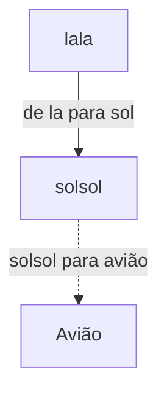

|AID|Textfile|Atribuído em|Entregar até|Revisado RD|Aprovado RD|
|:----:|:----:|:----:|:----:|:----:|:----:|
|???|???|28/07/2018|31/07/2018|Deixar em Branco|Deixar em Branco|

## Conceitos Primitivos
### Quais são os conceitos primitivos dessa aula? Liste-os e explique cada um deles sucintamente. Use imagens representativas para sua explicação. Esboce um diagrama.
> * **O que é:** Geralmente, é o primeiro tópico essencial. Há casos em que ocorrem outras definições primitivas ao longo da aula TAMBÉM.
> * [**Resposta Tipo Diagrama Descrição AQUI**](https://home.rdresolucoes.com/respostasqb#diagrama)
> [**Detalhes da Pergunta**](https://home.rdresolucoes.com/perguntasqb#conceitos-primitivos)
>* A **definição** de um conceito primitivo é:
>   * Todo conceito que precisa ser definido antes que possamos definir outros conceitos, normalmente baseados nesse primeiro
	>	 * **Ex:**
	> 		* "O que é proposição" seria um conceito primitivo
	> 		* Proposição composta não
	> 		* Operações com proposições não
	> 		* Tipos de Proposição não, caso a definição de proposição esteja na mesma aula

>**Regras**
> * Condense as definições de cada conceito primitivo;
> * Utilize Palavras Chaves na explicação;
> * As explicações devem ser diretas e abundantes;
> * [**Mais Regras**](https://home.rdresolucoes.com/regrasgeraisqb#diagramas);

---
==Resposta(Diagrama)==
{

}

---
## A Chave dos Tópicos
### Construa explicações rápidas para cada tópico dos tópicos essenciais e liste-as abaixo. Desconsidere o conceito primitivo como um tópico essencial, para responder essa pergunta. Use e abuse de exemplos rápidos que possam definir um tópico essencial. Esboce um diagrama.
> **O que é**
> Essa resposta seria um resumo que um aluno que visse sua aula faria, porém sem copiar os exemplos que você deu e usando a estrutura de um diagrama. A ideia aqui é que o aluno consiga perceber que *não é decorando os exemplos dados na aula que o fará compreender a matéria*, e sim *construindo seus próprios raciocínios* de forma organizada.
>
>[**Detalhes da Pergunta**](https://home.rdresolucoes.com/perguntasqb#a-chave-dos-tópicos)
>
> **Regras**
> * Inclua fórmulas importantes aqui, além de qualquer caso específico ou exemplo útil.
> * **Dito anteriormente: Não copie o conteúdo anterior, gere novo conteúdo a partir da aula que foi dada**
> * Inclua uma imagem vetorizada, preferencialmente um "ícone", para cada tópico
> * Em matérias de biológicas (anatomia, por exemplo), substitua as imagens representativas por imagens dos livros do material base (como sobotta/Netter para anatomia)

---
==Resposta(Diagrama)==
{

}

---
==Resposta(Diagrama)==
{

}

---
==Resposta(Diagrama)==
{

}

---
==Resposta(Diagrama)==
{

}

---

# CheckList
 - [ ] Respondi todas as perguntas do questionário base utilizando apenas os materiais bibliográficos fornecidos
 - [ ] Se há imagens em meu material, elas são de alta qualidade
 - [ ] Todas as imagens contém legenda, fonte e ano
 - [ ] Todo conteúdo matemático do meu material está em linguagem Latex e/ou comando markdown+kadex(comandos do stackeditor)
 - [ ] Todo conteúdo gráfico do meu material foi confeccionado usando a(s) ferramenta(s) _____________, liberado(s) pela RD
 - [ ] Todo conteúdo de química do meu material está em linguagem Latex e/ou foi confeccionado nos aplicativos liberados pela RD
 - [ ] Todo conteúdo do meu material de biológicas, se aplicável, está utilizando a terminologia correta e com diagramas de alta qualidade, com partes escritas legíveis
 - [ ] Todas as explicações detalhadas continham pelo menos 3 imagens(Exatas) ou 5 imagens(biológicas)
 - [ ] As templates usadas para os flashcards foram listadas
 - [ ] As tabelas de conteúdo das respectivas templates foram preenchidas completamente
 - [ ] As ordens de aparecimento dos elementos do flashcards foram fornecidos
 - [ ] Todo o conteúdo das falas(transcrições) do meu material foi confeccionado contendo detalhes das contas vocalizadas, além de estarem expressas de forma clara e informal
 - [ ] Caso eu falte com a verdade em qualquer das afirmações acima, compreendo que terei abatimento no valor final pago, com chances do material ser totalmente rejeitado pelo cliente

#### Auto-Avaliação de Respostas: 10,0
Se achar que sua resposta **não** merecer um 10, edite o valor acima. Lembre-se! A nota de Autoavaliação tem de ser _a mais próxima possível das outras notas de avaliação de conteúdo!_

## Contatos Úteis
* [Programação, Erros de Compilação e Exportação de Material](mailto:HelpDeskTI@rdresolucoes.com)

* [Financeiro RDResoluções](mailto:financeiro@rdresolucoes.com)

* [Pedidos de Conteúdo Premium Atlas Humano 3D](mailto:imagens@rdresolucoes.com)
